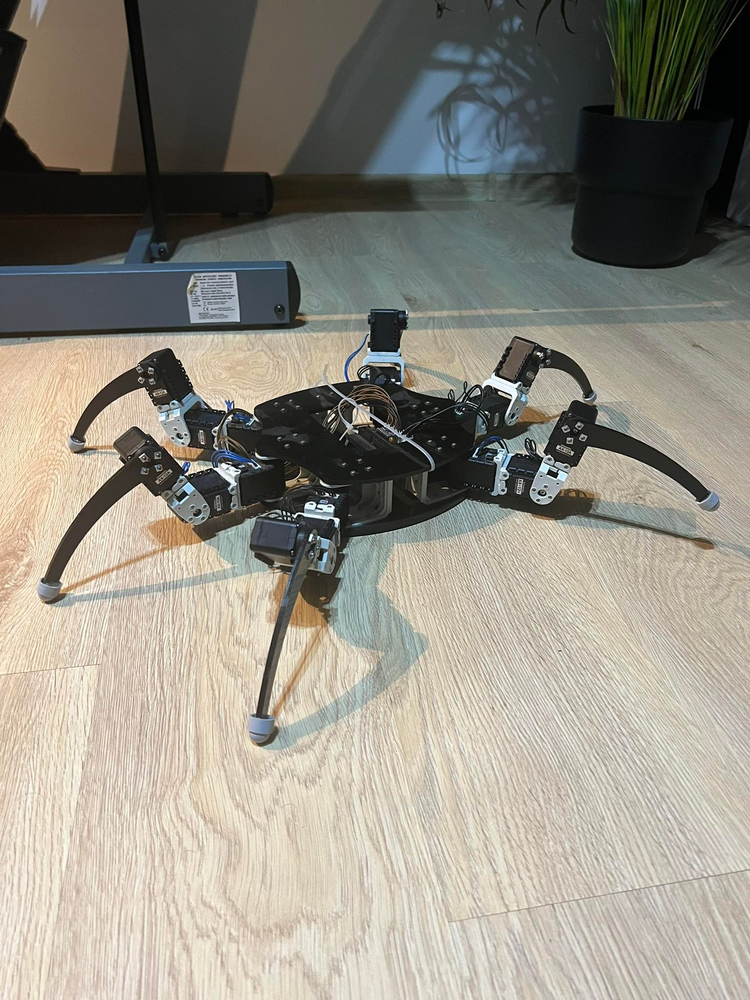

## Basic Info

- 👋 Hi, I’m @TheKureq - Michał Kurek
- 👀 I’m interested in robotics, frontend web development
- 🌱 I’m currently learning Python 🐍 OpenCV with Deep learning and react ⚛
- 📫 you can reach me by email: m.kurek200@gmail.com

## Robotics / Software developer

#### You can find my Robotics projects on my creator instagram:
- https://www.instagram.com/kurek_workshop/

#### DevStack:
| Technologies | Next Technologies |
| ------ | ------ |
| C++ | OpenCV Python, C++ |
| C | Machine learning |
| Python | Inverse kinematics |
| ST | === |
| LAD | === |
| CAD | === |
| Gcode | === |

## Frontend developer

#### WebStack

| Technologies | Next Technologies |
| ------ | ------ |
| 🟡 JavaScript | ⚛ React |
| 🔵 CSS | 🟦 TypeScript |
| 🟠 HTML | 🟩 Node.js |
| 🔴 SASS | === |
| 🟣 Bootstrap | === |
| 🟢 SQL | === |
| 🥤  Gulp / npm | === |
| 📱   Responsive web design | === |
| 📢 SEO | === |

#### Next project:
- 🟥 Netflix copy (React.js)

<!---
TheKureq/TheKureq is a ✨ special ✨ repository because its `README.md` (this file) appears on your GitHub profile.
You can click the Preview link to take a look at your changes.
--->
